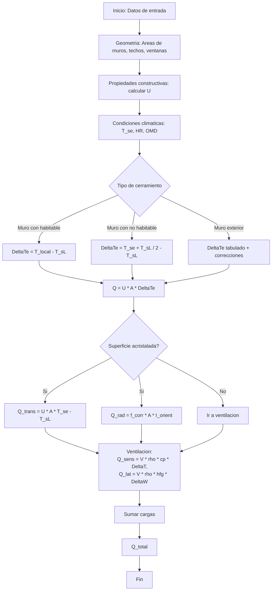
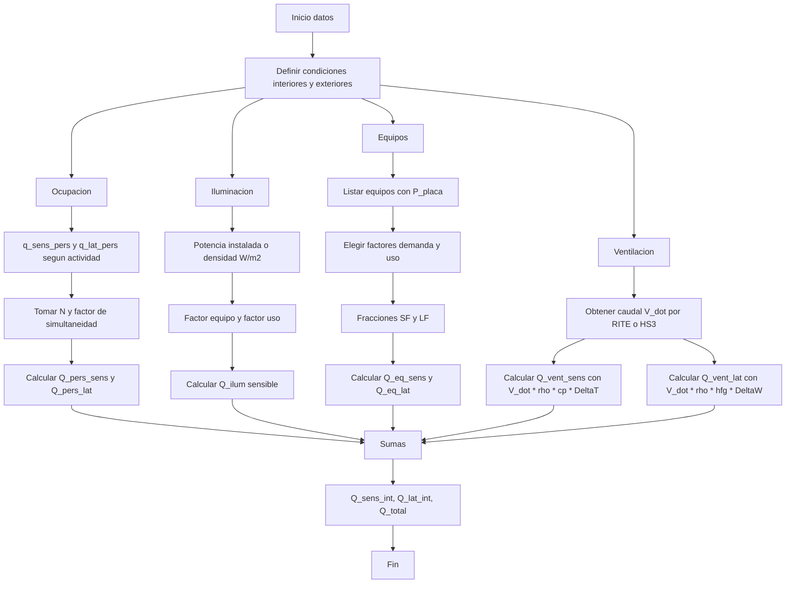

3 Métodos de resolución:
- NotebookLM
- Alumno
- ChatGPT
### 1. Cargas térmicas

- **Introducción**
    - **Carga térmica:** Potencia de refrigeración o calentamiento que necesita una instalación, en un instante dado, para mantener condiciones térmicas interiores específicas.
    - **Cálculo de cargas:** Balance de pérdidas y ganancias de calor, incluyendo componentes sensibles (afectan la temperatura) y latentes (afectan el vapor de agua/humedad).
    - **Aplicaciones:** Acondicionamiento de aire (Calefacción y Refrigeración).

### 2. Condiciones de diseño

- **2.1 Condiciones del ambiente térmico interior**
    - **Variables a controlar:** Temperatura seca, humedad relativa, calidad del aire interior (renovación), nivel de ruido (ITE 02 aptdo. 2.3.1), y velocidad del aire.
    - **Reglamento aplicable (RITE):** Reglamento de Instalaciones Térmicas de los Edificios (Real Decreto 1027/2007, modificado por el Real Decreto 178/2021 y Real Decreto 1826/2009).
    - **Temperatura de cálculo:** 21 ºC para el dimensionamiento de sistemas de calefacción.
    - **Calidad del aire interior:** Requerimientos para edificios no residenciales (RITE, IT 1.1.4.2.3) y edificios de viviendas (Documento Básico HS Salubridad. HS 3).
- **2.2 El ambiente exterior**
    - **Variables:** Temperatura seca y temperatura húmeda, radiación solar, y temperatura del terreno.
    - **Normativa:** Norma UNE 100001 (Condiciones climáticas para proyectos) y Norma UNE 100014 (Condiciones exteriores de cálculo).
    - **Datos climáticos:** Tablas de datos y Oscilación Media Anual (OMA).
    - **Momento de máxima carga:** Se requiere estimar la máxima carga térmica. Generalmente, máxima carga de refrigeración ocurre sobre las **15h solares de Julio** y máxima carga de calefacción sobre las **7h solares de Enero**.
    - **Temperatura del terreno:** En cálculos de refrigeración no se tiene en cuenta la carga negativa por el suelo. Se puede estimar con la temperatura media anual o la temperatura del agua de red (CTE, DB HE Anejo G).

### 3. Clasificación y metodología del cálculo de cargas

- El cálculo debe realizarse para la **máxima carga térmica**, tanto para recintos individualizados, zonas (conjunto de locales servidos por un mismo equipo), y para todo el edificio.
- Se suele utilizar un **coeficiente de seguridad** del 10% (pudiendo disminuirse al 5% si el cálculo es detallado).

#### 3.1 Cargas exteriores

- **Cargas a través de paredes, suelos y techos**:
    - Cálculo de la carga sensible por transmisión ($Q_{sen}$) usando el coeficiente global de transferencia de calor ($U$) y la diferencia de temperatura equivalente ($\Delta t_e$).
    - **$U$** depende de los espesores, conductividades térmicas, y coeficientes de convección.
    - **$\Delta t_e$** (Diferencia de temperatura equivalente): Se utiliza para considerar la transferencia de calor en régimen no permanente debido a la temperatura exterior variable, la radiación, y la inercia del muro.
    - **Inercia térmica:** Se puede usar el método simplificado de valores tabulados de $\Delta t_e$.
    - **Cargas en calefacción:** No se considera la radiación y se consideran despreciables las inercias térmicas en las paredes.
- **Cargas a través de superficies acristaladas**:
    - **Transmisión:** Se calcula de forma directa debido a la poca inercia del vidrio ($Q_{sen} = A U (T_{se} - T_s)$).
    - **Radiación:** Depende de la hora, mes, orientación, latitud y accesorios. Se usan factores de corrección para elementos de sombra (exteriores 0.2, interiores 0.6). En calefacción no se considera la radiación.
- **Cargas debidas a ventilación**:
    - Se calcula la carga sensible ($Q_{sen}$) y la carga latente ($Q_{lat}$) basadas en el caudal de ventilación.
    - Los caudales de ventilación se calculan con un factor de ocupación del **100%**.

#### 3.2 Cargas interiores

- Las cargas interiores **solo se consideran en refrigeración**. En calefacción, se calcula para mínima presencia de personas, luces y equipos.
- **Ocupantes:** Se calcula la carga sensible ($Q_{sen}$) y latente ($Q_{lat}$) multiplicando los valores por persona (70W sensible, 60W latente) por el número de personas y el factor de simultaneidad (ej: Oficinas 0,75-0,9).
- **Iluminación:** La carga sensible depende del tipo de luminaria (ej: Fluorescente con reactancia interna: Potencia útil x1,2).
- **Maquinaria/equipos**.
- **Instalación**.

### 4. Código técnico de la edificación (CTE)

- **Marco Normativo:** Establece las exigencias de seguridad y habitabilidad.
- **Exigencias Básicas:** Incluyen Seguridad estructural (DB-SE), Seguridad en caso de incendio (DB-SI), Seguridad de utilización y accesibilidad (DB-SUA), Salubridad (DB-HS), Protección frente al ruido (DB-HR), y **Ahorro de energía (DB-HE)**.
- **Documento Básico "DB HE Ahorro de energía"**:
    - Define parámetros y objetivos para satisfacer las exigencias de ahorro de energía.
    - **Secciones clave:**
        - HE0 Limitación del consumo energético.
        - HE1 Condiciones para el control de la demanda energética. (Incluye transmitancia de la envolvente térmica (3.1.1) y control solar (3.1.2)).
        - HE2 Condiciones de las instalaciones térmicas. (Esta exigencia se desarrolla en el RITE).

## 1. Esquema de los Pasos de Resolución del Problema (Carga Térmica)

El cálculo de la carga térmica sigue un proceso riguroso que se adapta según el régimen (verano para refrigeración, invierno para calefacción), donde la principal diferencia reside en el tratamiento de las ganancias térmicas internas y solares.

### A. Régimen de Refrigeración (Carga Máxima de Verano)

El cálculo se centra en determinar la ganancia térmica máxima, generalmente a la hora solar más desfavorable (ej. 12h o 15h).

|Paso|Tarea Clave|Tipo de Ganancia (Carga)|Referencias de Cálculo Específicas|
|:--|:--|:--|:--|
|**1. Condiciones de Diseño**|**Definir $t_s$ y $\omega$** (interior y exterior).||UNE 100014, UNE 100001 (para valores de $t_{se}, t_{hc}$ y OMD).|
|**2. Corrección de $t_e$**|**Ajustar la temperatura exterior** si la hora de cálculo no es la de diseño (15h) o si la OMD es distinta a la de tabla.||Tablas de corrección horaria, utilizando la OMD.|
|**3. Propiedades de la Envolvente**|**Calcular $U$ y $A$** de todos los cerramientos.||DA DB-HE1 (para $R_{T}'', R_{T}'$ y $U$), Catálogo CTE.|
|**4. Transmisión Sensible**|**Ganancia a través de cerramientos expuestos (muros/techos)** por conducción e inercia.|$\dot{Q}_{trans,sens}$|**Método simplificado:** $\dot{Q} = U \cdot A \cdot \Delta t_e$. Determinar $\Delta t_e = \Delta t_{e,TABLA} + \text{corrección}$.|
|**5. Transmisión/Particiones**|**Ganancia a través de ventanas** (conducción) y particiones interiores.|$\dot{Q}_{trans,sens}$|$\Delta t_{eVENTANA} = t_{se} - t_{sL}$. Estimar $t_{local\ no\ climatizado}$ para particiones.|
|**6. Radiación Solar**|**Ganancia directa a través de superficies acristaladas**.|$\dot{Q}_{rad,sens}$|$\dot{Q}_{rad} = f_{corrección} \cdot A \cdot I_{ORIENTACIÓN}$. Consultar factores de corrección (ej. Vidrio doble 0.9).|
|**7. Cargas Internas**|**Ganancias sensibles y latentes** por ocupación, iluminación y equipos.|$\dot{Q}_{int,sens}$ y $\dot{Q}_{int,lat}$|Perfiles de uso y condiciones operacionales (Anejo D DB HE).|
|**8. Ventilación**|**Cargas sensibles y latentes** por la renovación de aire exterior.|$\dot{Q}_{vent,sens}$ y $\dot{Q}_{vent,lat}$|Caudal $\dot{V}$ según CTE DB HS 3 o RITE IT 1.1.4.2.|
|**9. Carga Total**|Sumar todas las cargas sensibles y latentes calculadas.|$\dot{Q}_{total}$|$\dot{Q}_{total} = \sum \dot{Q}_{sens} + \sum \dot{Q}_{lat}$.|

### B. Régimen de Calefacción (Carga Máxima de Invierno)

El cálculo se simplifica buscando la condición más desfavorable (máxima pérdida).

|Paso|Tarea Clave|Tipo de Carga|Puntos Clave / Simplificaciones|
|:--|:--|:--|:--|
|**1. Condiciones de Diseño**|**Definir $t_s$ y $\omega$** (interior y exterior).||Usar NPE=97.5% para el exterior.|
|**2. Simplificación de Cargas**|**Se anulan** las ganancias que mitigarían la pérdida de calor.|$\dot{Q}_{int}=0, \dot{Q}_{rad}=0$|Se asume **radiación solar nula** y **cargas internas nulas** (personas, luces, equipos).|
|**3. Transmisión (Pérdida)**|Pérdida de calor a través de la envolvente.|$\dot{Q}_{trans,sens}$|**Se asume régimen estacionario:** $\Delta t_e = t_{se} - t_{sL}$. Revisar $U$ si el flujo térmico invierte $R_{si}''$.|
|**4. Ventilación (Pérdida)**|Pérdida sensible y latente por renovación de aire.|$\dot{Q}_{vent,sens}$ y $\dot{Q}_{vent,lat}$|Cálculo idéntico al de verano, pero con las temperaturas y humedades de diseño de invierno.|
|**5. Carga Total**|Sumar pérdidas de transmisión y ventilación.|$\dot{Q}_{total}$|El resultado es la pérdida que el sistema de calefacción debe compensar.|

---

## 2. Abstracción y Proceso de Resolución Estándar (Cargas Térmicas)

El proceso estándar se divide en tres fases principales: Definición, Caracterización de la Envolvente y Cuantificación de Cargas. Este proceso es aplicable tanto para refrigeración como para calefacción, ajustando las condiciones iniciales (Fase 1) y los componentes de carga (Fase 3).

### Fase 1: Definición y Parámetros de Diseño

| Paso                            | Qué hacer                                                                                                                                                                     | Documentación a Consultar                                                                                                      | Glosario de Fórmulas y Situaciones                                                                                                          |
| :------------------------------ | :---------------------------------------------------------------------------------------------------------------------------------------------------------------------------- | :----------------------------------------------------------------------------------------------------------------------------- | :------------------------------------------------------------------------------------------------------------------------------------------ |
| **1.1. Condiciones Climáticas** | Establecer temperaturas secas (interior $t_{sL}$, exterior $t_{se}$) y humedades. Determinar el Punto de Entrada (PE) para el exterior (ej. 5% en verano, 97.5% en invierno). | UNE 100014, UNE 100001. RITE IT 1.2.4.1.1: Usar $T_{S, 1\%}$ (Verano) y $T_{S, 99\%}$ (Invierno) para cargas térmicas máximas. | Utilizar el **Diagrama Psicrométrico** para obtener humedades específicas ($\omega_L, \omega_e$) y temperaturas de bulbo húmedo ($t_{hc}$). |
|**1.2. Corrección Horaria**|(Solo Refrigeración) Ajustar los valores exteriores si la hora de cálculo (ej. 12h) difiere de la hora estándar (ej. 15h) o si la Oscilación Media Diaria (OMD) varía.|Tablas de corrección horaria de la normativa de diseño climático.|$\Delta t_{e} = \Delta t_{e,TABLA} + \text{corrección}$. La corrección depende de las condiciones locales de $t_{se}$ y OMD.|
|**1.3. Densidad y Calor Específico**|Fijar las propiedades del aire para los cálculos de ventilación.|Valores estándar o basados en las condiciones de diseño.|$\rho$ (Densidad del aire), $c_p$ (Calor específico del aire), $h_{fg}$ (Calor latente de vaporización del agua).|

### Fase 2: Caracterización de la Envolvente

|Paso|Qué hacer|Documentación a Consultar|Glosario de Fórmulas y Situaciones|
|:--|:--|:--|:--|
|**2.1. Transmitancia Térmica ($U$)**|Calcular la transmitancia térmica para todos los cerramientos, incluyendo puentes térmicos si es detallado.|**DA DB-HE1**, **Catálogo de elementos constructivos del CTE**. UNE EN ISO 6946:2012.|**U:** $U = \frac{1}{R_{total}''}$. Donde $R_{total}''$ es el límite inferior de la resistencia térmica total. La resistencia de una capa homogénea es $R = e/\lambda$.|
|**2.2. Particiones Interiores**|Calcular $U$ para suelos o particiones en contacto con espacios no habitables (ej. sótanos, cámaras sanitarias).|**DA DB-HE1:** Apartados 2.1.3 (Particiones interiores) y Tablas 7 y 9 (Coeficiente de reducción $b$, soleras, cámaras sanitarias).|**U Particiones:** $U = U_P \cdot b$, donde $b$ puede calcularse mediante $b = H_{h-nh} / (H_{h-nh} + H_{nh-e})$.|
|**2.3. Áreas**|Determinar las áreas ($A$) netas y, específicamente para refrigeración, las áreas acristaladas por orientación.|Planos arquitectónicos o dimensiones del local.|$A_{muro} = A_{total} - A_{ventana}$.|

### Fase 3: Cuantificación de Cargas Térmicas

El cálculo se divide en la suma de componentes sensibles ($\dot{Q}_{sens}$) y latentes ($\dot{Q}_{lat}$).

#### Cargas Sensibles

| Componente                                      | Fórmulas Clave                                                                | Situaciones y Observaciones                                                                                                                                                                                                  |
| :---------------------------------------------- | :---------------------------------------------------------------------------- | :--------------------------------------------------------------------------------------------------------------------------------------------------------------------------------------------------------------------------- |
| **3.1. Transmisión Envolvente** (Muros, Techos) | $\dot{Q}_{trans,sens} = U \cdot A \cdot \Delta t_e$.                          | **Verano:** Se usa $\Delta t_e$ corregida por inercia y radiación. **Invierno:** $\Delta t_e = t_{sL} - t_{se}$ (simplificado).                                                                                              |
| **3.2. Transmisión Ventanas** (Conducción)      | $\dot{Q}_{trans,sens} = U \cdot A_{ventana} \cdot (t_{se} - t_{sL})$.         | Válido tanto para verano como para invierno. En verano, la inercia es despreciable para ventanas.                                                                                                                            |
| **3.3. Radiación Solar**                        | $\dot{Q}_{rad,sens} = F_{corrección} \cdot A_{sol} \cdot I_{ORIENTACIÓN}$.    | **Solo Verano.** $I_{ORIENTACIÓN}$ es la irradiancia solar. $F_{corrección}$ incluye el factor de vidrio doble (0.9) y elementos de sombra exteriores. El cálculo de $q_{sol;jul}$ es un parámetro de control solar DB HE 1. |
| **3.4. Cargas Internas Sensibles**              | $\dot{Q}_{sens,int} = \dot{Q}_{pers,sens} + \dot{Q}_{ilum} + \dot{Q}_{equi}$. | **Solo Verano de diseño.** En invierno, estas cargas se consideran nulas para calcular la máxima pérdida. La iluminación y los equipos son "solicitaciones interiores".                                                      |
| **3.5. Ventilación Sensible**                   | $\dot{Q}_{vent,sens} = \dot{V} \cdot \rho \cdot c_p \cdot (t_{se} - t_{sL})$. | Aplicable en ambos regímenes. El caudal de ventilación ($\dot{V}$) debe basarse en CTE DB HS 3 (Calidad del aire interior) o RITE IT 1.1.4.2.                                                                                |

#### Cargas Latentes

|Componente|Fórmulas Clave|Situaciones y Observaciones|
|:--|:--|:--|
|**3.6. Cargas Internas Latentes**|$\dot{Q}_{lat,int} = \dot{Q}_{pers,lat} \cdot n^{\circ}_{pers} \cdot f_{sim}$.|**Solo Verano de diseño.** En invierno, se consideran nulas.|
|**3.7. Ventilación Latente**|$\dot{Q}_{vent,lat} = \dot{V} \cdot \rho \cdot h_{fg} \cdot (\omega_{e} - \omega_{L})$.|Aplicable en ambos regímenes. Representa la energía asociada al cambio de humedad.|
|**3.8. Carga Total**|$\dot{Q}_{total} = \sum \dot{Q}_{sens} + \sum \dot{Q}_{lat}$.|Es la carga que el sistema (frío o calor) debe compensar.|

### Documentación Normativa Adicional (Marco de Referencia)

- **RITE (Reglamento de Instalaciones Térmicas en los Edificios):** Establece las exigencias de eficiencia energética, seguridad, bienestar e higiene que deben cumplir las instalaciones térmicas (calefacción, refrigeración, ventilación, ACS). Las cargas calculadas sirven para dimensionar los generadores, cuya potencia debe ajustarse a la demanda máxima simultánea. El RITE también establece los percentiles de temperatura a usar para el cálculo de cargas máximas ($T_{S, 1\%}$ en verano, $T_{S, 99\%}$ en invierno).
- **CTE DB HE (Ahorro de Energía):**
    - **HE 1 (Control de la Demanda Energética):** Determina las características de la envolvente para limitar las necesidades de energía, incluyendo la limitación de transmitancia ($U_{lim}$) y el control solar ($q_{sol;jul}$).
    - **DA DB HE 1:** Documento de Apoyo que proporciona métodos simplificados para calcular parámetros de la envolvente, como la resistencia total y la transmitancia.
    - **HE 4 (Contribución mínima de energía renovable para ACS):** Regula el dimensionamiento de ACS y la contribución renovable, lo que afecta a las cargas latentes totales.
- **CTE DB HS (Salubridad):**
    - **HS 3 (Calidad del Aire Interior):** Fundamental para determinar el caudal de ventilación ($\dot{V}$) que se utiliza para calcular las cargas sensibles y latentes de ventilación.

![[Pasted image 20250924131353.png]]
![[Pasted image 20250924131406.png]]
![[Pasted image 20250924131416.png]]

# CHATGPT

---

# Método estándar de resolución — Cargas Térmicas

## 0) Datos base (siempre antes de empezar)

* **Plano y geometría del recinto/zona:** dimensiones, orientaciones, tipos de cerramiento y acristalamientos.
* **Uso del local:** ocupación prevista, iluminación instalada, equipos.
* **Condiciones de diseño interior:** $t_{sL}$ y HR objetivo (RITE: 25 °C verano, 21 °C invierno como valores de cálculo típicos; ajustar a enunciado si lo fija).
* **Condiciones de diseño exterior:** $t_{se}$ (verano 1 % / invierno 99 %), $t_{hc}$ y, si procede, OMD/OMA; localizar la ciudad en tablas UNE 100001/100014.
* **Caudal de ventilación reglamentario:** por RITE IT 1.1.4.2 (no residencial) o CTE DB-HS3 (vivienda).

> Tip psicrometría: con $t$ y HR (o $t$ y $t_{hc}$) fija $\omega$ exterior e interior en el diagrama para la parte **latente**.

---

## A) Verano — Carga máxima de refrigeración (estructura del estudiante)

**Objetivo de hora:** 15 h solares de julio (si no, aplicar corrección horaria/OMD).

### 1. Calcular U de cada cerramiento

* **Fórmula base:**

$$
U=\dfrac{1}{R_{tot}^{\prime\prime}}=\left(\dfrac{1}{h_i}+\sum\dfrac{e_i}{\lambda_i}+\dfrac{1}{h_e}\right)^{-1}
$$

Propiedades: CTE (Catálogo) y DA DB-HE (resistencias, cámaras de aire).  

* **Particiones con no habitables/suelo**: aplicar coeficientes de reducción $b$ según DA DB-HE1 cuando proceda (soleras, cámaras sanitarias).

### 2. Determinar $\Delta t_e$ (clave del método del profe)

* **Muros/Techos exteriores:** usar **$\Delta t_e$ tabulado por orientación y hora** que ya incluye radiación + inercia (método Carrier simplificado). Si tus $t_{se}$/$t_{sL}$ u OMD difieren de la tabla, **suma la corrección** indicada en las tablas de ajuste.
* **Ventanas (conducción):** $\Delta t_e = t_{se}-t_{sL}$ (inercia despreciable).
* **Medianeras / particiones:**
  * Contra **otro local habitable**: $T_{seq}=T_{s,\text{otro local}}$.
  * Contra **no habitable**: $T_{seq}=\dfrac{t_{se}+t_{sL}}{2}$.
  * **Al exterior:** usar tablas de $\Delta t_e$ (párrafo anterior).

### 3. Áreas

* **Áreas netas de cada elemento** (resta huecos en muros, separa acristalado por orientación). $A_{muro}=A_{total}-A_{ventanas}$.

### 4. Cálculo de $\dot Q_T$ — separar **SENSIBLES** y **LATENTES**

#### 4.1 Sensibles

* **Transmisión (muros/techos):** $\dot Q_{trans,sens}= U\cdot A \cdot \Delta t_e$ con $\Delta t_e$ tabulado+corrección.
* **Transmisión (ventanas):** $\dot Q=U\cdot A\cdot (t_{se}-t_{sL})$.
* **Radiación solar por acristalamiento:**

$$
\dot Q_{rad}= f_{\text{corr}}\cdot A \cdot I_{\text{orient}}
$$

  Usar $I_{\text{orient}}$ por hora/orientación (gráficas) y **factores de corrección**: vidrio doble ≈ 0.9; persiana exterior ≈ 0.2; cortina interior ≈ 0.6.  

* **Cargas internas sensibles:**
  * $\dot Q_{ilum}$ (según tipo de luminaria: fluorescente con reactancia int. ≈ 1.2·Pot útil, etc.)
  * $\dot Q_{equip}$ según catálogo o dato de enunciado
  * $\dot Q_{pers,sens}\approx 70\ \text{W/pers} \cdot f_{sim}$.

* **Ventilación sensible:**

$$
\dot Q_{vent,s}=\dot V\cdot \rho \cdot c_p \,(t_{se}-t_{sL})
$$

  **$\dot V$** por RITE/HS3; usa $\rho\approx1.2\ \mathrm{kg/m^3}$, $c_p\approx1020\ \mathrm{J/(kg\,K)}$ salvo que el enunciado pida otros.

#### 4.2 Latentes

* **Ocupación:** $\dot Q_{pers,lat}\approx 60\ \text{W/pers}\cdot f_{sim}$.
* **Ventilación latente:**

$$
\dot Q_{vent,lat}= \dot V \cdot \rho \cdot h_{fg}\,(\omega_e-\omega_L)
$$

con $h_{fg}\approx 2{,}501{,}300\ \mathrm{J/kg}$. (Obtén $\omega$ en el diagrama psicrométrico a partir de $t$ y HR).

### 5. Suma y márgenes

* **Carga sensible total:** $\sum \dot Q_{sens}$.
* **Carga latente total:** $\sum \dot Q_{lat}$.
* **Carga total:** $\dot Q_{tot}= \dot Q_{sens}+\dot Q_{lat}$.
* **Coeficiente de seguridad típico:** +10 % (o +5 % si el cálculo es muy detallado).

---

## B) Invierno — Carga máxima de calefacción (estructura del estudiante)

**Simplificación docente (según apuntes):**

* **U (invierno) = U (verano).**
* **$\Delta t_e$** por cerramiento **sin radiación ni inercia**: típicamente $\Delta t_e=t_{sL}-t_{se}$ (signo según convención).
* **Áreas:** mismas que en verano.
* **Cálculo de $\dot Q_T$:**
  * **Sensibles:** Transmisión (todos los cerramientos) + **Ventilación sensible**.
  * **Latentes:** **Solo ventilación latente** (ocupación/iluminación/equipos y radiación **NO** se consideran).
  * Para HR exterior, como guía: **80–85 % interior peninsular; 90 % zonas cercanas al mar/ríos** (efecto en la latente por $\omega_e$).

**Fórmulas:**

* $\dot Q_{trans}= U\cdot A \cdot (t_{sL}-t_{se})$.
* $\dot Q_{vent,s}=\dot V \cdot \rho \cdot c_p\,(t_{se}-t_{sL})$.
* $\dot Q_{vent,lat}= \dot V \cdot \rho \cdot h_{fg}\,(\omega_e-\omega_L)$.

---

## C) Plantilla de entrega (lista de chequeo por ejercicio)

1. **Condiciones de diseño**
   * Interior: $t_{sL}$, HR (anota norma o enunciado). Exterior: $t_{se}$ (percentil), $t_{hc}$, OMD/OMA, hora de cálculo. **Fuentes citadas** (UNE/RITE) o dato de problema.

2. **Envolvente**
   * Tabla con: *Elemento | Orientación/Contacto | Capas | $U$ | Área | $\Delta t_e$ usado | Observaciones (corrección OMD / Tseq)*.
   * Justifica $U$ con DA DB-HE/Catálogo y **$\Delta t_e$** con tabla de orientación+corrección (verano) o $t_{sL}-t_{se}$ (invierno).

3. **Cargas sensibles**
   * Transmisiones muros/techos/ventanas → $\dot Q=U\,A\,\Delta t_e$.
   * Radiación (solo verano) → $A\,I_{\text{orient}}$ con factores de vidrio/sombra.
   * Internas sensibles (solo verano) → ocupación/ilum/equipos con factores de simultaneidad.
   * Ventilación sensible → $\dot V$ por RITE/HS3.

4. **Cargas latentes**
   * Ocupación (solo verano) y **ventilación** (ambos). Psicrometría para $\omega$.

5. **Resultados**
   * $\dot Q_{sens}$, $\dot Q_{lat}$, $\dot Q_{tot}$.
   * **Coef. seguridad** y **comentarios** (orientación crítica, efecto de sombras).

---

## D) Documentación que debes abrir en cada paso

* **RITE** (condiciones interiores, caudales de ventilación; limitación de temperaturas; método por persona/uso).
* **UNE 100001 / 100014** (datos climáticos de proyecto, percentiles, $t_{se}$, $t_{hc}$, OMA/OMD).
* **CTE DB-HE + DA DB-HE1** (cálculo de $U$, resistencias, cámaras, particiones; límites $U$ y control solar).
* **DB-HS3** (vivienda) o **RITE IT 1.1.4.2** (no residencial) para $\dot V$.
* **Tablas/veranos del curso**: $\Delta t_e$ por orientación y **correcciones** por OMD/hora (método simplificado) + **gráficas $I_{\text{orient}}$** y factores de corrección de sombras/vidrios.

---

## E) Mini-guía de decisiones rápidas (lo que más “pilla” en examen)

* **¿Hora ≠ 15 h?** Aplica corrección a $\Delta t_e$.
* **Medianeras:** decide Tseq según *habitable / no habitable / exterior*.
* **Radiación en invierno:** **no se computa** (es ganancia).
* **Ventilación:** usar **100 % ocupación** para asegurar calidad de aire.
* **Seguridad:** añade **+10 %** si el método es simplificado.

---

# Notas
![[Pasted image 20250926112502.png]]
![[Pasted image 20250926112516.png]]
**NPE (%)** → _Nivel de Percentil de Exigencia_: indica el valor estadístico que se usa para dimensionar.

- 99 % y 97,5 % → significa que en el 99 % o 97,5 % del tiempo la temperatura **es superior** a la dada. Es decir, son valores de diseño “muy fríos”.
- **TS (°C)** → _Temperatura seca exterior_ de cálculo en invierno (mínima probable).

- **GD/año (K)** → _Grados-día de calefacción_. Sirve para estimar necesidades energéticas anuales (no se usa en carga máxima, sino en consumo estacional).

- **Viento (m/s, dirección)** → velocidad y dirección predominante del viento en condiciones de invierno.
![[Pasted image 20250926113008.png]]
## 🔎 Ejemplo de lectura

Tomemos **Alicante (El Altet)**:

- **Invierno**:
    
    - A percentil 97,5 % → TS=+3,6 °CTS = +3,6 \, °CTS=+3,6°C.
        
    - A percentil 99 % → TS=+2,5 °CTS = +2,5 \, °CTS=+2,5°C.
        
    - Es decir: raramente baja de 2–3 °C, por eso la carga de calefacción en Alicante es pequeña.
        
    - Grados-día de calefacción: 517 (muy bajos comparados con Burgos = 2384).
        
- **Verano**:
    
    - Percentil 1 % → TS=31,5 °CTS = 31,5 \, °CTS=31,5°C, THc=21,8 °CTHc = 21,8 \, °CTHc=21,8°C.
        
    - Percentil 2,5 % → TS=30,2 °CTS = 30,2 \, °CTS=30,2°C, THc=21,5 °CTHc = 21,5 \, °CTHc=21,5°C.
        
    - Percentil 5 % → TS=29,1 °CTS = 29,1 \, °CTS=29,1°C, THc=21,6 °CTHc = 21,6 \, °CTHc=21,6°C.
        
    - OMD = 9,8 °C → poca oscilación térmica diaria (clima costero estable).
        
    - Eso significa que en Alicante la humedad relativa es el factor más crítico, no la temperatura.

## 1️⃣ Fórmulas de corrección de temperaturas exteriores

👉 Fórmulas:

$T_{se} = T_{se,\text{max,NPE}} - \text{Corrección}_{HORA} - \text{Corrección}_{MES}$
$T_{hc} = T_{hc,\text{max,NPE}} - \text{Corrección}_{HORA} - \text{Corrección}_{MES}$

- **Qué significa**:
    En tablas climáticas tienes un **valor máximo de diseño** (por ejemplo, temperatura seca 36 °C en Cáceres al 1%).
    Pero ese valor se da en una condición “extrema” (normalmente 15h en julio).
    Si calculas en **otra hora** o en **otro mes**, debes restar correcciones.

---
![[Pasted image 20250926114930.png]]
![[Pasted image 20250926114941.png]]
### 🔧 Ejemplo práctico

Supón que estás calculando la carga en **Cáceres**:

- Tabla climática (verano, NPE=1%): $T_{se,\text{max}} = 36.3 \,°C$.
- Oscilación media diaria (OMD) de Cáceres = 13.6 °C.
- Quieres calcular a las **12h solares** en **junio**.

1. **Corrección hora** (Tabla 1):
    - OMD=14 aprox., 12h $\rightarrow$ corrección = 2.8 °C.

2. **Corrección mes** (Tabla 3):
    - Para junio, OMA $\approx$ 35 °C $\rightarrow$ corrección $\approx$ 0.6 °C.

3. **Resultado**:
    $$T_{se} = 36.3 - 2.8 - 0.6 = 32.9 \, °C$$

👉 Es decir, aunque en tablas figura 36 °C, **a las 12h de junio “sólo” se espera 33 °C**, y con eso calculas tu $\Delta T_e$.

---

## 2️⃣ Carga sensible y latente

- **Carga sensible** = la parte de la carga térmica debida a **temperatura**.
    Ejemplo: Un aula con cristaleras orientadas al oeste. A las 17h entra el sol, la temperatura interior tiende a subir 3 °C $\rightarrow$ eso es carga sensible.

- **Carga latente** = la parte de la carga térmica debida a **humedad**.
    Ejemplo: En el mismo aula entran 30 personas. Cada persona exhala vapor de agua al respirar. Además, ventilas con aire exterior (Cáceres, 32 °C y HR=40%). El aire trae humedad $\rightarrow$ eso es carga latente.

👉 El aire acondicionado debe bajar **la temperatura (sensible)** y además **condensar agua en la batería fría (latente)**.

---
![[adoc-Diagrama Psicrometrico.pdf]]
## 3️⃣ Diagrama psicrométrico

En la gráfica:

- Eje X: temperatura seca (°C).
- Líneas curvas: humedad relativa (%).
- Eje derecho: humedad absoluta (kg agua/kg aire seco).
- Líneas inclinadas: entalpía (energía total).

### 🔧 Ejemplo de uso real

1. Aire exterior en Cáceres (julio, 15h):
    - $T_{se} = 36 \, °C$, HR = 40 %.
    - En el psicrométrico, este punto está en 36 °C y HR 40%.
    - Tiene una humedad absoluta, por ejemplo 0.013 kg/kg.

2. Aire interior deseado:
    - 25 °C y HR = 50 %.
    - En el psicrométrico, humedad absoluta $\approx$ 0.010 kg/kg.

3. Diferencia de humedad:
    - $\Delta\omega = 0.003$ kg/kg.
    - Si renuevas 5000 m³/h de aire, tu máquina deberá **condensar** unos 15 litros de agua por hora (carga latente).

👉 Así ves que **no sólo se trata de enfriar aire**, sino de **deshumidificarlo** para estar cómodos.

# 📘 Esquema de Cálculo de Cargas Exteriores

## 1️⃣ Cargas a través de paredes, techos y suelos

**Fórmula general:**

$$Q_{sen} = U \cdot A \cdot \Delta T_e$$

- **U (W/m²K)**: coeficiente global de transmisión térmica.
    $$U = \dfrac{1}{\dfrac{1}{h_i} + \sum \dfrac{e_i}{\lambda_i} + \dfrac{1}{h_e}}$$
    - $e_i$: espesor de cada capa [m].
    - $\lambda_i$: conductividad térmica [W/mK].
    - $h_i, h_e$: coeficientes de convección interior/exterior [W/m²K].
        📖 **Fuente:** CTE DB-HE1 + Catálogo CTE.
- **A (m²)**: área del cerramiento (restando huecos).
    📖 Fuente: planos arquitectónicos.
- **$\Delta T_e$ (K)**: diferencia de temperatura equivalente.
    - Si muro con **otro local habitable**: $T_{seq}=T_{local}$.
    - Si muro con **no habitable**: $T_{seq}=\dfrac{T_{se}+T_{sL}}{2}$.
    - Si muro con **exterior**: $\Delta T_e$ tabulado por orientación y hora, considerando radiación + inercia.
        📖 Fuente: Tablas Carrier o UNE 100014 (ajustando por OMD y correcciones horarias).

---

## 2️⃣ Cargas a través de superficies acristaladas

**Transmisión (igual que muros, sin inercia):**

$$Q_{sen} = U \cdot A \cdot (T_{se} - T_{sL})$$

**Radiación solar:**

$$Q_{rad} = f_{corr} \cdot A \cdot I_{orient}$$

- $I_{orient}$: irradiancia solar (W/m²) según orientación, hora y mes.
- $f_{corr}$: factores de corrección (vidrio doble = 0.9, persiana = 0.2, cortina = 0.6).
    📖 Fuente: gráficas de aportación solar (Carrier, Pinazo, CTE DB-HE1 $q_{\text{sol;jul}}$).

---

## 3️⃣ Cargas debidas a ventilación

**Sensible:**

$$Q_{sen} = \dot{V}_{vent} \cdot \rho \cdot c_p \cdot (T_{se} - T_{sL})$$

**Latente:**

$$Q_{lat} = \dot{V}_{vent} \cdot \rho \cdot h_{fg} \cdot (\omega_e - \omega_L)$$

- $\dot{V}_{vent}$ (m³/s): caudal de aire de ventilación.
    📖 Fuente: RITE o CTE DB-HS3 (ocupación $\times$ l/s persona).
- $\rho$ (kg/m³): densidad del aire $\approx$ 1.2 kg/m³.
- $c_p$ (J/kgK): calor específico del aire $\approx$ 1020 J/kgK.
- $h_{fg}$ (J/kg): calor latente vaporización $\approx 2,5\cdot 10^6$ J/kg.
- $\omega$ (kg agua/kg aire seco): humedad absoluta $\rightarrow$ se obtiene del **diagrama psicrométrico** con (T, HR).

---

# 📊 Diagrama de Flujo (Mermaid)

    
# 🛠️ Ejemplo práctico

👉 **Problema:** Oficina en **Cáceres** (julio, 15h).

- Área muro norte = 20 m², $U=1.2 \, \text{W/m}^2\text{K}$.
- Ventana sur = 5 m², $U=2.8 \, \text{W/m}^2\text{K}$, vidrio doble.
- Interior: $25 \, °\text{C}$, $\text{HR}=50 \, \%$. Exterior: $36 \, °\text{C}$, $\text{HR}=40 \, \%$.
- Ventilación: $400 \, \text{m}^3/\text{h}$.

### Paso 1: Muro exterior

- $\Delta T_e$ tabulado norte ($15\text{h}$, $\text{OMD}=13.6$) $= 1.7 \, \text{K}$.
$$Q_{muro} = 1.2 \cdot 20 \cdot 1.7 = 40.8 \, \text{W}$$

### Paso 2: Ventana (conducción)

$$Q_{\text{vent,trans}} = 2.8 \cdot 5 \cdot (36-25) = 154 \, \text{W}$$

### Paso 3: Radiación por ventana

- $I_{sur}(15\text{h}) \approx 700 \, \text{W/m}^2$.
- Con vidrio doble ($0.9$):
$$Q_{rad} = 0.9 \cdot 5 \cdot 700 = 3150 \, \text{W}$$

### Paso 4: Ventilación

- $\dot{V}=400/3600=0.111 \, \text{m}^3/\text{s}$.
- Sensible:
$$Q_{sens} = 0.111 \cdot 1.2 \cdot 1020 \cdot (36-25) = 1500 \, \text{W}$$
- Latente:
    - $\omega$ exterior ($36 \, °\text{C}$, $40 \, \% \, \text{HR}$) $\approx 0.013 \, \text{kg/kg}$.
    - $\omega$ interior ($25 \, °\text{C}$, $50 \, \% \, \text{HR}$) $\approx 0.010 \, \text{kg/kg}$.
    - $\Delta\omega=0.003$.
    $$Q_{lat} = 0.111 \cdot 1.2 \cdot 2.5\cdot 10^6 \cdot 0.003 = 1000 \, \text{W}$$

---

### ✅ Resultado total

- Muro: $41 \, \text{W}$
- Ventana trans: $154 \, \text{W}$
- Radiación ventana: $3150 \, \text{W}$
- Ventilación sensible: $1500 \, \text{W}$
- Ventilación latente: $1000 \, \text{W}$

**Carga total $\approx 5845 \, \text{W} \approx 5.8 \, \text{kW}$**

# 📘 Esquema de Cálculo de Cargas Internas

En refrigeración se suman; en calefacción para el dimensionamiento máximo suelen no considerarse porque son ganancias.

---

## 1.1 Ocupación

Qué aporta: **sensible + latente** por metabolismo y respiración.

**Fórmulas**
$$Q_{\text{pers\_sens}} = N \cdot q_{\text{sens,pers}} \cdot f_{\text{sim}}$$
$$Q_{\text{pers\_lat}} = N \cdot q_{\text{lat,pers}} \cdot f_{\text{sim}}$$

| Símbolo | Unidad | Descripción | Valor Típico (Oficina) |
| :---: | :---: | :--- | :--- |
| $N$ | personas | Número de personas. | - |
| $q_{\text{sens,pers}}$ | W/pers | Carga sensible por persona. | $70 \, \text{W}$ |
| $q_{\text{lat,pers}}$ | W/pers | Carga latente por persona. | $60 \, \text{W}$ |
| $f_{\text{sim}}$ | - | Factor de simultaneidad. | $0.75 \text{ a } 0.9$ |
| $Q$ | W | Resultado de la carga. | - |

**De dónde salen**
Tablas docentes y manuales de climatización por actividad. El enunciado da el aforo o la densidad $\text{m}^2$ por persona.

---

## 1.2 Iluminación

Qué aporta: **todo sensible**.

**Fórmula**
$$Q_{\text{ilum}} = P_{\text{instalada}} \cdot f_{\text{uso}} \cdot f_{\text{equipo}}$$

| Símbolo | Valor Típico |
| :---: | :--- |
| Densidad de potencia en oficinas | $7 \text{ a } 12 \, \text{W/m}^2$ con LED. |
| $f_{\text{equipo}}$ Incandescente | $1.0$ |
| $f_{\text{equipo}}$ Fluorescente | $1.2$ |
| $f_{\text{equipo}}$ LED | $1.0$ |

**Fuentes**
Proyecto eléctrico o datos del fabricante. Si no hay, usar $\text{W/m}^2$.

---

## 1.3 Equipos y maquinaria

Qué aportan: mayoritariamente **sensible**; algunos equipos generan **latente** si hay evaporación o cocción.

**Fórmulas**
$$Q_{\text{eq\_sens}} = \sum P_{\text{placa}} \cdot f_{\text{demanda}} \cdot f_{\text{uso}} \cdot SF$$
$$Q_{\text{eq\_lat}} = \sum P_{\text{placa}} \cdot f_{\text{demanda}} \cdot f_{\text{uso}} \cdot LF$$

| Símbolo | Descripción | Valor Típico (Oficina) |
| :---: | :--- | :--- |
| $P_{\text{placa}}$ | W equipo. | - |
| $f_{\text{demanda}}$ | Carga media respecto a placa ($0$ a $1$). | - |
| $f_{\text{uso}}$ | Tiempo en servicio ($0$ a $1$). | - |
| $SF$ | Fracción sensible. | PC $SF \approx 0.95$, impresora $SF \approx 0.9$. |
| $LF$ | Fracción latente ($LF = 1 - SF$). | Cocina con campana $LF$ apreciable. |

**Fuentes**
Fichas técnicas y tablas orientativas de manuales.

---

## 1.4 Ventilación de aire exterior

Qué aporta: **sensible y latente** por el aire nuevo exigido por normativa.

**Fórmulas**
Sensible:
$$Q_{\text{vent\_sens}} = \dot V \cdot \rho \cdot c_p \cdot (T_{se} - T_{sL})$$
Latente:
$$Q_{\text{vent\_lat}} = \dot V \cdot \rho \cdot h_{fg} \cdot (\omega_e - \omega_L)$$

| Símbolo | Valor | Unidad |
| :---: | :---: | :--- |
| $\dot V$ | - | $\text{m}^3/\text{s}$ (RITE o CTE HS 3 por persona o por $\text{m}^2$). |
| $\rho$ | $\approx 1.2$ | $\text{kg/m}^3$ |
| $c_p$ | $\approx 1020$ | $\text{J/kg}\cdot\text{K}$ |
| $h_{fg}$ | $\approx 2.5\cdot 10^6$ | $\text{J/kg}$ |
| $T_{se}, T_{sL}$ | - | $^\circ\text{C}$ de diseño. |
| $\omega$ | - | $\text{kg agua}/\text{kg aire seco}$ (del diagrama psicrométrico con $T$ y $\text{HR}$). |

---

## 1.5 Sumas finales

$$Q_{\text{sens,int}} = Q_{\text{pers\_sens}} + Q_{\text{ilum}} + Q_{\text{eq\_sens}} + Q_{\text{vent\_sens}}$$
$$Q_{\text{lat,int}} = Q_{\text{pers\_lat}} + Q_{\text{eq\_lat}} + Q_{\text{vent\_lat}}$$
$$Q_{\text{int,total}} = Q_{\text{sens,int}} + Q_{\text{lat,int}}$$

Nota de buena práctica: usa factor de ocupación $100\%$ para obtener el caudal de ventilación reglamentario.

---

## 2) Diagrama de flujo Mermaid — Cargas internas

# 🛠️ Ejemplo práctico paso a paso

**Caso**: Oficina de $100 \, \text{m}^2$ en **Cáceres** en verano

- Interior $25 \, °\text{C}$ $\text{HR } 50 \, \%$.
- Exterior $36 \, °\text{C}$ $\text{HR } 40 \, \%$.
- Densidad $10 \, \text{m}^2$ por persona $\rightarrow \mathbf{N = 10}$.
- Simultaneidad oficinas $\mathbf{f_{\text{sim}} = 0.85}$.
- Iluminación LED $\mathbf{10 \, \text{W/m}^2}$.
- Equipos: $10$ PCs $100 \, \text{W}$, $1$ impresora $500 \, \text{W}$.
    - $f_{\text{demanda}}$ PC $= 0.6$, impresora $= 0.25$.
    - $SF$ PC $0.95$, impresora $0.9$.
- Ventilación: $12.5 \, \text{L/s}$ por persona $\rightarrow \dot V = 0.125 \, \text{m}^3/\text{s}$ (para $10$ personas).

---

### Ocupación

$$Q_{\text{pers\_sens}} = 10 \cdot 70 \cdot 0.85 = \mathbf{595} \, \text{W}$$
$$Q_{\text{pers\_lat}} = 10 \cdot 60 \cdot 0.85 = \mathbf{510} \, \text{W}$$

---

### Iluminación

$$Q_{\text{ilum}} = 100 \, \text{m}^2 \cdot 10 \, \text{W/m}^2 \cdot 1.0 = \mathbf{1000} \, \text{W}$$

---

### Equipos

**Cálculos de carga sensible ($Q_{\text{eq\_sens}}$):**

* PCs: $10 \cdot 100 \, \text{W} \cdot 0.6 \cdot 0.95 = 570 \, \text{W}$
* Impresora: $500 \, \text{W} \cdot 0.25 \cdot 0.9 = 112.5 \, \text{W}$

$$Q_{\text{eq\_sens}} = 570 + 112.5 = \mathbf{682.5} \, \text{W}$$

$$Q_{\text{eq\_lat}} \approx \mathbf{0} \, \text{W} \text{ (típicamente despreciable en oficina)}$$

---

### Ventilación

- **Sensible**
    * $\Delta T = 36 - 25 = 11 \, \text{K}$
    $$Q_{\text{vent\_sens}} = 0.125 \cdot 1.2 \cdot 1020 \cdot 11 = \mathbf{1683} \, \text{W}$$
    
- **Latente**
    * Del psicrométrico: $\omega_e \approx 0.013 \, \text{kg/kg}$, $\omega_L \approx 0.010 \, \text{kg/kg} \rightarrow \Delta \omega = 0.003$
    $$Q_{\text{vent\_lat}} = 0.125 \cdot 1.2 \cdot 2.5\cdot 10^6 \cdot 0.003 = \mathbf{1125} \, \text{W}$$

---

### Sumas

$$Q_{\text{sens,int}} = 595 + 1000 + 682.5 + 1683 = \mathbf{3960.5} \, \text{W}$$
$$Q_{\text{lat,int}} = 510 + 0 + 1125 = \mathbf{1635} \, \text{W}$$
$$Q_{\text{int,total}} = 3960.5 + 1635 = \mathbf{5595.5} \, \text{W} \approx \mathbf{5.6 \, \text{kW}}$$

---

> Cómo usarlo: rellenas cada bloque siguiendo el **flujo Mermaid** y sumas al final sensible y latente. Si la normativa del ejercicio pide un **margen de seguridad**, añade $5 \text{ a } 10 \, \%$.

¿Quieres que te prepare la **plantilla rellenable** en Markdown con los campos para que solo tengas que sustituir tus datos?